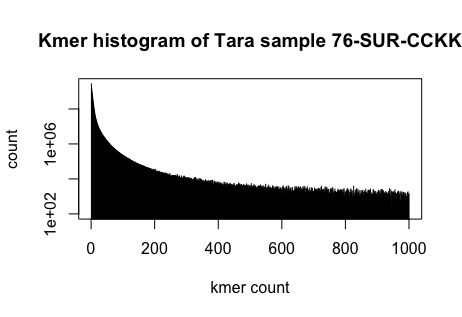

# MetaG bacterial read sets

- Raw data may be found from EBI web site: https://www.ebi.ac.uk/ena/browser/view/PRJEB402
- Identifiers, as prepared byEric Pelletier, CEA, Genoscope : [bact_metag_tara.txt](bact_metag_tara.txt)

## A look to the data

Total fastq.gz size: 6.1TB.

Contains 241 lines / stations.

## Estimating the number of kmers of each station. (k=20)

Using `ntcard` (release 1.2.2) we obtained for all read sets and, independently, for each station, the estimated number of distinct kmers ($k=20$) and of distinct kmers occurring twice or more. 

### Estimation of all reads:

Command

```bash
ntcard -t 20 -k 20 -p all_bact_metaG_20_mers *.fastq.gz
```

Result [all_bact_metaG_20_mers_k20.hist](all_bact_metaG_20_mers_k20.hist).

In short, there are about 266 billion distinct kmers, among which 174 billion occur twice or more. 


### kmer spectrum for all reads

spectrum generated with [plot_histo.R](plot_histo.R)


### kmer spectrum for one station. 

Chosen randomly: station 76_sur_CCKK.



### Estimation per station:

Results: [estimated_kmer_counts_metaG_bact](estimated_kmer_counts_metaG_bact)

Analysed with script `analyse_hist_tara.py`

For each station, the estimated number of kmers occurring twice or more is given in the [est_solid_20kmers_bact_tara.txt](est_solid_20kmers_bact_tara.txt) file.

Min.   :3.189e+08 

1st Qu.:1.918e+09 

Median :2.659e+09 

Mean   :2.578e+09 

3rd Qu.:3.095e+09 

Max.   :5.284e+09  

Biggest set contains > 5 billions distinct 20-mers occurring twice or more.


## Computing a threshold for kmer rescuing
kmtricks proposes a way to save in a dataset a kmer whose coverage is in a range $[2, t]$, as soon as this kmer has a coverage $> t$ in at least another dataset.
Note that in a dataset, a kmer seen more than $t$ times is conserved. 

We propose to compute for each set  this threshold $t$ as the smallest value $\geq 1$ such that the number of canonical kmers occurring t times is smaller
than 10% of the total number of canonical kmers. kmtricks automatically performs this computation with option `--merge-abundance-min 0.1`.

Results file: [upper_rare_kmer_thresholds_10_percent.txt](upper_rare_kmer_thresholds_10_percent.txt)

Among 241 sets, 
- 1 has a $t$ value equal to 2
- 237 have a $t$ value equal to 3
- 3 have a $t$ value equal to 4


