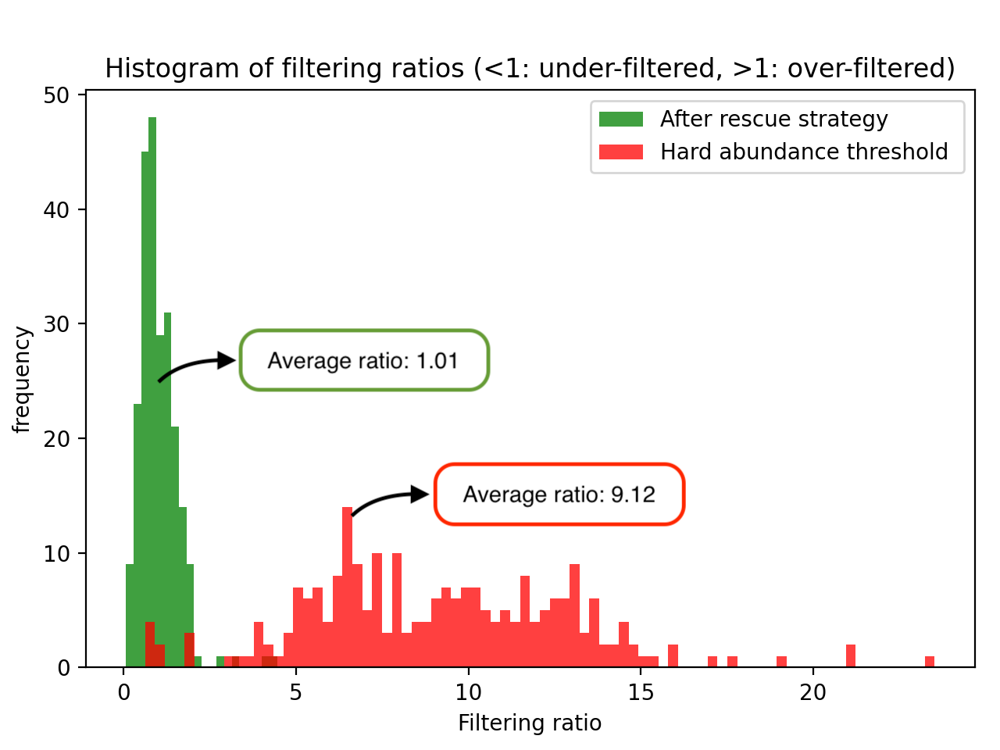

# Scripts and commands used for generating results about the rescued kmers.

## Input data:

[Logs](logs) from kmtricks, indicating for each partition, and for each dataset, the number of rescued kmers. 

The [estimation](estimated_kmer_counts_metaG_bact) of the total number of kmers and the number of kmers seen once, as computed by ntcard.

The [stations2techno.txt](stations2techno.txt) file, indicating for each read set the used Illumina technologie.

The computed theoretical error rate from *Acinetobacter baylyi* reads for the three technologies: 

| Techno | ReadPair | nb_reads      | Nb kmers   | Nb erroneous kmers | Error Rate (%) |
| ------ | -------- | ------------- | ---------- | ------------------ | -------------- |
| GAIIx  | 1        | 12037529      | 1378377359 | 25923501           | 0.0948         |
| GAIIx  | 2        | 12037529      | 1383555832 | 67308135           | 0.2490         |
| GAIIx  | 1&2      | (2x) 12037529 | 2761933191 | 93231636           | 0.1715         |
| --     |          |               |            |                    |                |
| HS2000 | 1        | 12037529      | 979185638  | 11029864           | 0.0566         |
| HS2000 | 2        | 12037529      | 976152716  | 13879961           | 0.0716         |
| HS2000 | 1&2      | (2x) 12037529 | 1955338354 | 24909825           | 0.0641         |
| --     |          |               |            |                    |                |
| HS2500 | 1        | 2202754       | 484673542  | 17295477           | 0.1815         |
| HS2500 | 2        | 2202754       | 484727354  | 55029084           | 0.6007         |
| HS2500 | 1&2      | (2x) 2202754  | 969400896  | 89620038           | 0.4838         |
| --     |          |               |            |                    |                |
| HS4000 | 1        | 8346834       | 1093563223 | 27893814           | 0.1291         |
| HS4000 | 2        | 8346834       | 1088376296 | 75010864           | 0.3564         |
| HS4000 | 1&2      | (2x) 8346834  | 2181939519 | 102904678          | 0.2413         |

## Script:

The (dirty) script [parse_merger.py](parse_merger.py) enables to combine all input data, and outputs for each station :

- The id (from 0 to 243)
- The station name
- The total number of kmers (as computed by ntcards) - Used for the figure creation.
- The total number of kmers conserved by kmtricks if the rescue process were not used
- The total number of kmers conserved by kmtricks with the rescue process - Used for the figure creation.
- The Illumina technology used for the corresponding station
- The Expected number of erroneous kmers (total_number * (1-(1-error_rate)^k)), with error_rate provided in the previous table. - Used for the figure creation.
- The ratio of  #filtered_kmers/#expected_number_erroneous - Used for the figure creation.
  - With or without the rescue process
- The number of kmer seen once - Used for the figure creation.
- The ratio of  #kmers_seen_once/#expected_number_erroneous - Used for the figure creation.
- The number of kmer seen twice
- The ratio of  (#kmers_seen_once + #kmers_seen_twice)/#expected_number_erroneous

Finaly: 1090815459740 have an abundance 1, 86212504001 are rescued by kmtrics, 98377921413 are theoretically FP

Results are provided in this [res_filtered_kmers.txt](res_filtered_kmers.txt )  file, and summarised in the figure: 

